# Отчёты план/факт

Документация по BI-отчётам и автоматизации планирования в Bitrix24.

Система позволяет отслеживать выполнение планов продаж и звонков, сравнивая плановые показатели с фактическими данными из CRM.

## Содержание

- [План-факт продаж (декомпозиция)](#план-факт-продаж-декомпозиция)
- [План/факт звонков по дням, неделям и месяцам](#планфакт-звонков-по-дням-неделям-и-месяцам)
- [Автоматизация](#автоматизация)
- [Требования](#требования)

---

## План-факт продаж (декомпозиция)

### Описание

Отчёт представляет собой **4 таблицы по кварталам** и **одну общую таблицу за год**. Нужный год выбирается в фильтре.

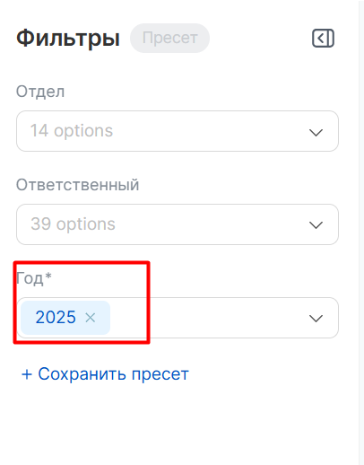

### Структура отчёта

В квартальной таблице отображаются все сотрудники, у которых есть план на соответствующий квартал заданного года.

**Показатели таблиц:**

| Показатель | Описание |
|---|---|
| План продаж | Целевая сумма продаж |
| Факт продаж | Фактическая сумма продаж |
| % выполнения плана продаж | Доля выполнения плана по продажам |
| План договоров | Целевое количество договоров |
| Факт договоров | Фактическое количество договоров |
| % выполнения плана | Доля выполнения плана по договорам |
| План заявок | Целевое количество заявок |
| Факт заявок | Фактическое количество заявок |
| % выполнения плана заявок | Доля выполнения плана по заявкам |

**Декомпозиция данных:**

- В **квартальных таблицах** показатели выводятся сначала за весь квартал, затем по каждому месяцу квартала.
- В **годовой таблице** — сначала за год, затем по каждому кварталу.

### Примеры таблиц

| 1 квартал | 2 квартал | 3 квартал | 4 квартал |
|:---:|:---:|:---:|:---:|
| 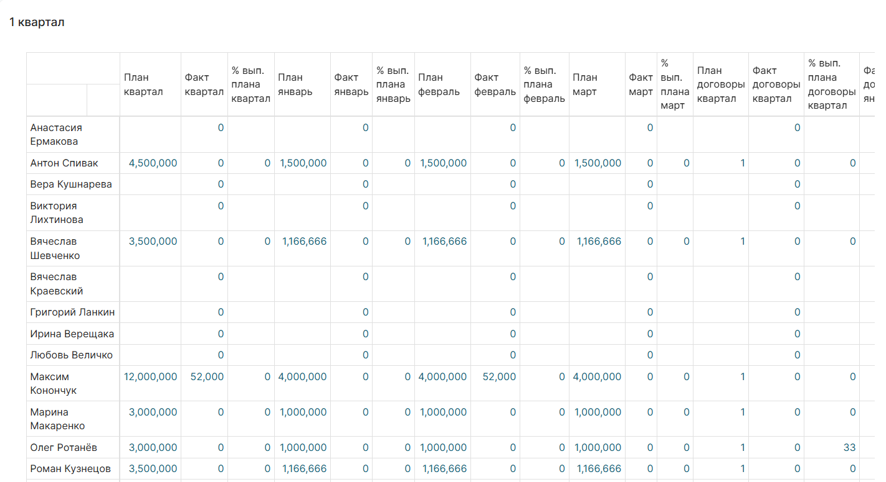 | 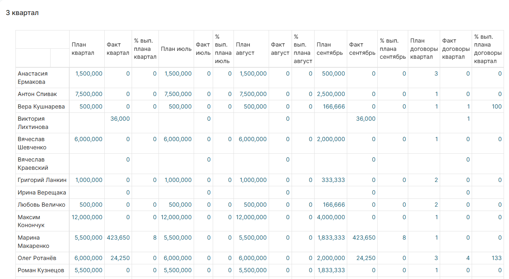 | 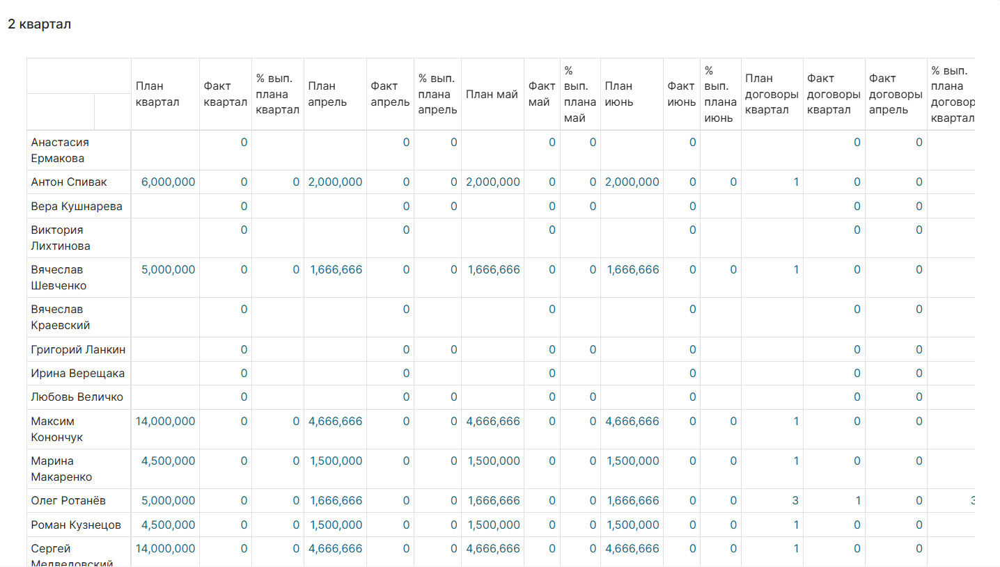 | 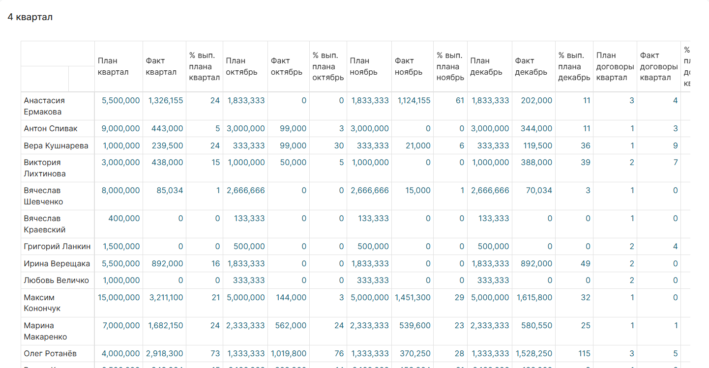 |

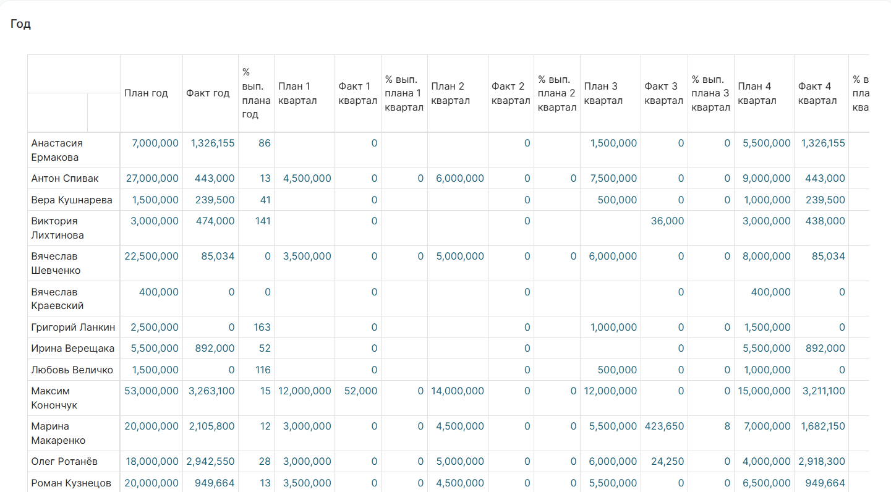

### Источник данных: смарт-процесс «Сделки квартал»

План — это элемент смарт-процесса в воронке **«Сделки квартал»**.

**Поля для создания плана:**

| Поле | Описание |
|---|---|
| Ответственный | Сотрудник, на которого назначен план |
| Сумма | Плановая сумма продаж |
| Договоры | Плановое количество договоров |
| Заявки | Плановое количество заявок |
| Год | Год, на который установлен план |

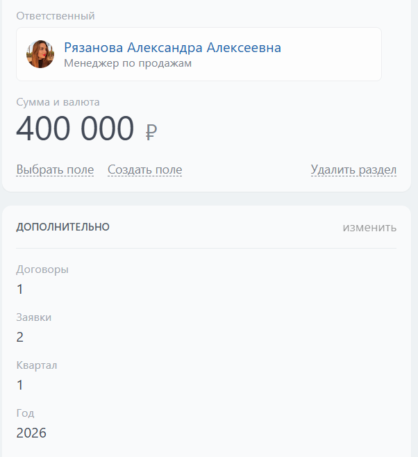

---

## План/факт звонков по дням, неделям и месяцам

> Отчёт BI: `[pavluk_online]`

### Описание

Отчёт представляет собой **4 таблицы** — **2 с планом** и **2 со статистикой**.

В таблицах с планом отображаются сотрудники, у которых есть план на месяц. Данные берутся из элементов смарт-процесса в воронке **«Звонки месяц»**.

### Показатели таблиц с планом

| Показатель | Описание |
|---|---|
| План звонков | Целевое количество звонков |
| Кол-во звонков | Фактическое количество звонков |
| Звонки > 30 сек. | Количество звонков длительностью более 30 секунд |
| Выполн. % | Процент выполнения плана |

> **Расчёт недельного плана:** месячный план делится на 4.  
> **Расчёт % выполнения:** считается по звонкам длительностью более 30 секунд.

### Примеры таблиц

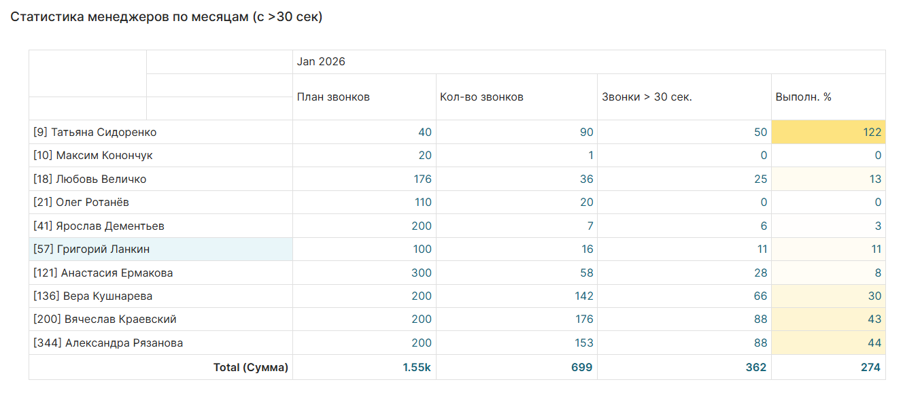

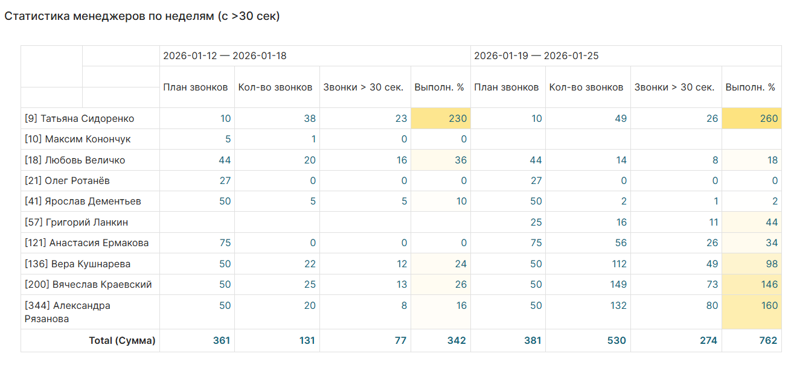

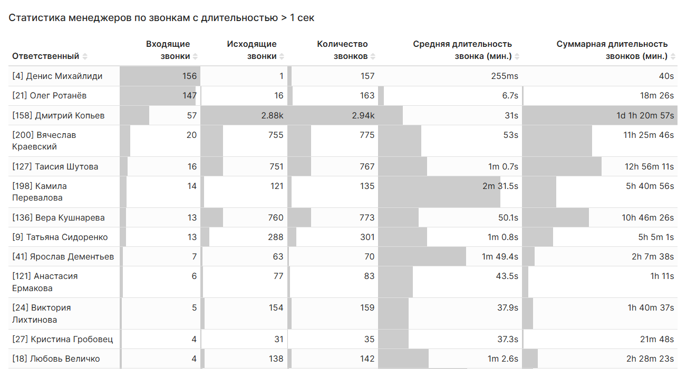

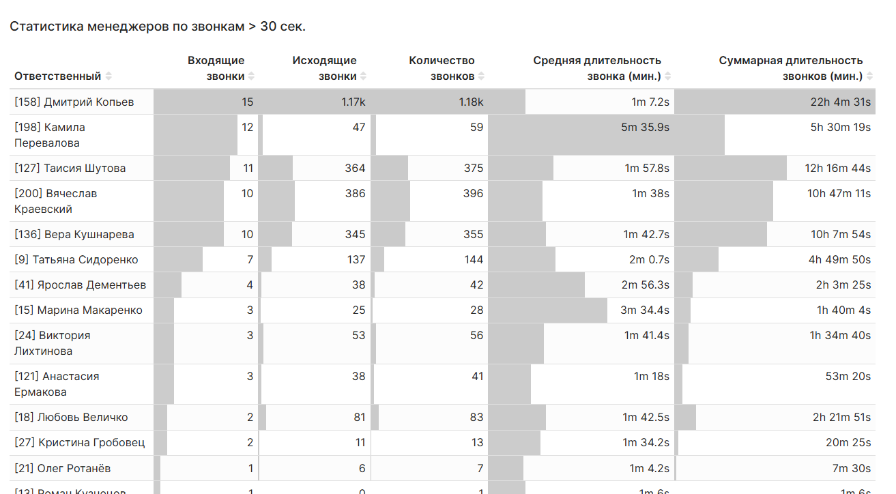

### Источник данных: смарт-процесс «Звонки месяц»

**Поля для создания плана:**

| Поле | Описание |
|---|---|
| Ответственный | Сотрудник, на которого назначен план |
| Месяц | Месяц плана |
| Звонки | Плановое количество звонков |
| Год | Год, на который установлен план |

---

## Автоматизация

При наступлении нового месяца или нового квартала **неактуальные планы автоматически закрываются в «Успех»**. Это позволяет:

- работать только с актуальными планами;
- хранить успешно закрытые планы как архив.

**Название планов** формируется автоматически и включает:

- ФИО ответственного;
- квартал или месяц;
- год.

### Бизнес-процессы

| Процесс | Назначение | Автозапуск |
|---|---|---|
| **Запуск смены стадии по всем элементам** | Получает все незакрытые планы, проверяет их и при необходимости запускает процесс «Смена стадии» | Нет |
| **Изменение** | Автоматически изменяет название элементов при создании и изменении планов | Создание, Изменение |
| **Смена стадии** | Закрывает неактуальные планы в «Успех» | Нет |

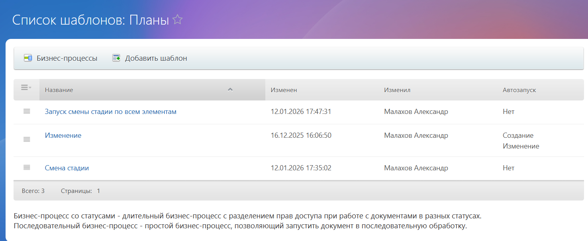

---

## Требования

Для корректной работы системы необходимо установленное приложение:

**[REST Активити Б24](https://www.bitrix24.ru/apps/app/rest_activity_b24/)**

Приложение используется бизнес-процессами для выполнения REST-запросов к Bitrix24.
